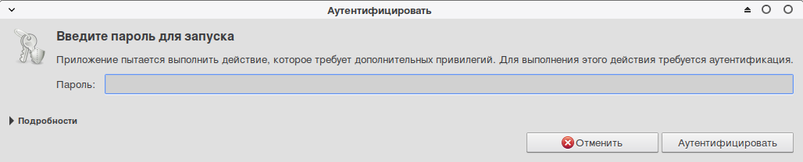
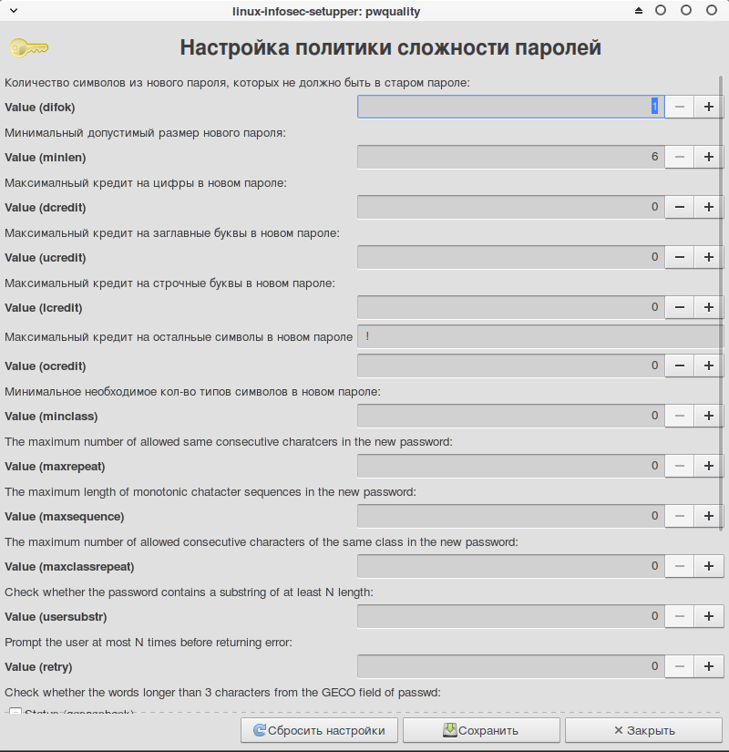
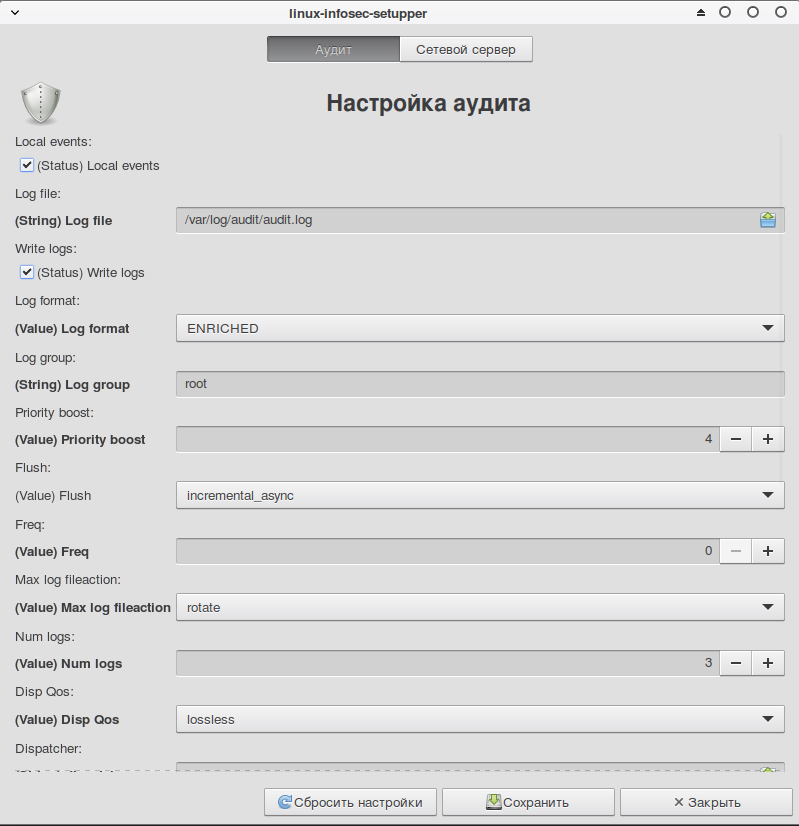
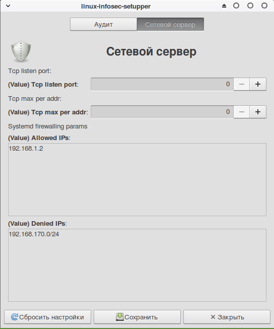

# linux-infosec-setupper

Утилиты для настройки функций безопасности ОС Linux

## Функционал и скриншоты

* Гибкая настройка авторизации через polkit

* Графический и CLI интерфейсы для настройки политики сложности паролей (lipwquality)

* Графический и CLI интерфейсы для настройки аудита событий информационнйо безопасности и сервера auditd

